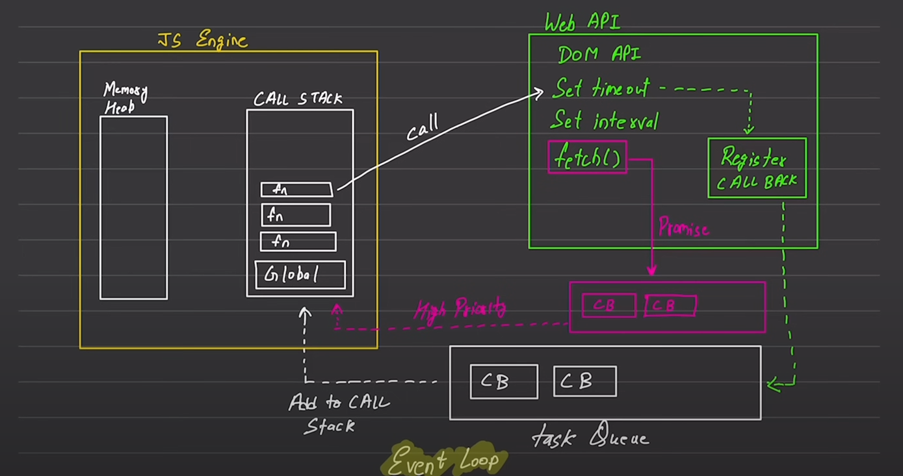

javascript is synchronous and single threaded

execution context
  execute one line of code at a time
  console.log - 1
  console.log - 2

  meaning, each operation waits for the lastone to complete before execution
   this are default behaviour of Js

   blocking code vs non blocking code

block the flow of program     
read file sync

non blocking does not block the execution and read file async 

